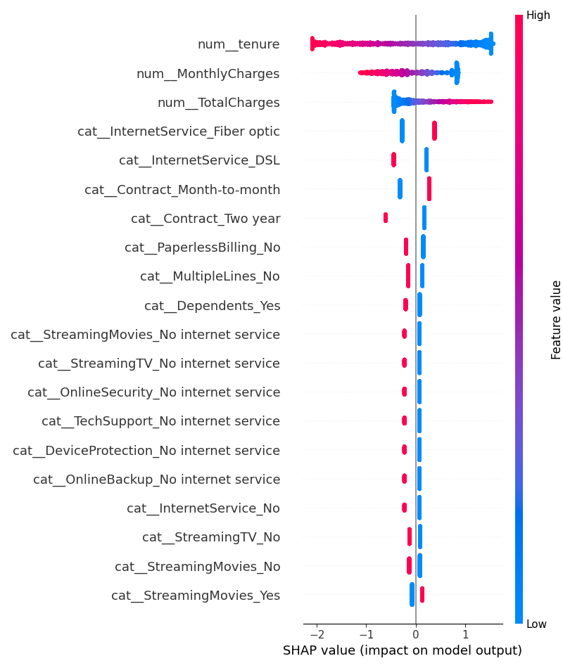

# 🚀 TelcoRetain-AI
Predicting which customers are likely to churn — and using AI to understand why they are at risk and what actions could help retain them.

**[🌐 Try the Live App](https://telcoretain-ai-giqizcznwrsnkkffxcz8je.streamlit.app/)**

---

## 🎯 Project Overview

Customer churn prediction is useful, but knowing that a customer is likely to leave is only the first step.

I extended my original customer churn prediction project into an **AI-powered Customer Intelligence application callled as TelcoRetain-AI**.

The application combines:

- Machine Learning for churn prediction
- Probability-based risk assessment
- SHAP for model explainability
- Streamlit for the web application
- Gemini API for AI-powered retention analysis

The goal is to answer two important questions:

> **Who is likely to churn?**

and

> **What can we do about it?**

---

## 💡 The Problem

Customer churn can be expensive for businesses.

A machine learning model can identify customers who are likely to leave, but a prediction alone does not tell a retention team what to do next.

This project therefore goes beyond prediction.

When a customer is classified as **Likely to Churn**, the application sends the relevant customer information to Gemini, which generates:

1. **Main risk factors**
2. **Practical retention actions**
3. **A professional customer message**

This creates a complete workflow from **prediction to action**.

---

## 🔄 Project Workflow

```text
Customer Information
        ↓
Data Preprocessing
        ↓
Machine Learning Model
        ↓
Churn Probability
        ↓
Threshold-Based Prediction
        ↓
 ┌───────────────────────┐
 │ Likely to Churn?      │
 └───────────────────────┘
        ↓ Yes
        ↓
SHAP / Customer Risk Factors
        ↓
Gemini AI
        ↓
AI Retention Analysis
        ↓
Risk Factors
Retention Actions
Customer Message
🔍 Key Insights from EDA

Contract length and tenure were the strongest churn-related patterns found during exploratory analysis.


🧠 Machine Learning Approach
1. Data Cleaning

The TotalCharges column was stored as text.

I converted it into a numeric feature and handled the blank entries belonging to customers with zero tenure.

2. Exploratory Data Analysis

I used:

Crosstab analysis
Groupby analysis
Churn-rate analysis
Feature comparisons

to identify important churn patterns.

3. Feature Engineering

I built a preprocessing pipeline using:

StandardScaler for numerical features
OneHotEncoder for categorical features
ColumnTransformer to combine both preprocessing steps
4. Model Training

I compared:

Logistic Regression
Random Forest
Gradient Boosting

Logistic Regression provided the strongest overall result for this project and was selected as the final model.

5. Threshold Tuning

Instead of using the default classification threshold of 0.50, I tested different thresholds.

Because missing a real churner can be more costly than contacting a customer who was going to stay, I prioritized churn recall.

The final threshold was:

0.35
Because it catches significantly more real churners (71% vs. 55% at default) at the cost of more false alarms, which is the right tradeoff when a false alarm just means an unnecessary retention offer, but a missed churner is a lost customer.


6. Explainability

I used SHAP to understand which features contribute to individual customer churn predictions.

This helps answer:

Why is this particular customer considered high risk?

📊 Model Performance
Model	Accuracy	Churn Recall	Churn Precision
Logistic Regression	0.80	0.55	0.64
Random Forest	        0.78	0.47	0.61
Gradient Boosting	0.80	0.53	0.67
ROC-AUC

0.841 — single test split

0.846 — 5-fold cross-validation

ROC Curve

🎚️ Threshold Tuning
Threshold	Churn Recall	Churn Precision
0.50	0.55	0.64
0.45	0.62	0.60
0.40	0.67	0.57
0.35	0.71	0.55
0.30	0.75	0.52

I selected 0.35 as the operating threshold because it increases the number of real churners detected compared with the default 0.50 threshold.

Confusion Matrix

🔎 Explainability with SHAP

The model predicts who is likely to churn.

SHAP helps explain why.

The analysis showed that factors such as:

Contract type
Tenure
Fiber optic internet
Electronic check payment
Technical support

play an important role in churn risk.



🤖 AI-Powered Retention Analysis

This is the major extension I added to the original project.

After the ML model identifies a customer as Likely to Churn, the application sends selected customer information and the churn probability to Gemini.

Gemini then generates a structured retention analysis.

AI Output
⚠️ Risk Factors

Identifies the main characteristics contributing to the customer's churn risk.


💡 Recommended Actions

Suggests practical actions that a retention team could consider.


💬 Customer Message

Generates a short and professional message that can be used as a starting point for customer communication.


🛡️ AI Safety / Grounding

The AI is instructed to base its recommendations only on the customer information provided.

It is also instructed not to invent:

Specific discounts
Prices
Refunds
Subscription plans
Company policies

This reduces the risk of the AI making unsupported business claims.

⚡ Conditional AI Execution

Gemini is only called when the ML model predicts:

Likely to Churn

If the customer is predicted to stay, the application does not make an unnecessary AI request.

This makes the workflow more efficient and reduces unnecessary API usage.

🖥️ Streamlit Application

The project is deployed as an interactive Streamlit application.

The user can enter customer information and receive:

1. Customer Summary

Displays important customer information such as:

Tenure
Monthly charges
Total charges
Contract
Internet service
Technical support


2. Churn Prediction

The application displays:

Churn probability
Prediction
Risk indicator
3. AI Retention Analysis

For high-risk customers, the application provides:

Risk factors
Recommended actions
Customer communication message

🧰 Tech Stack
Machine Learning

Python · pandas · NumPy · scikit-learn

Explainability

SHAP

Visualization

matplotlib · seaborn

Application

Streamlit

Generative AI

Google Gemini API · google-genai

Development

Jupyter Notebook · Git · GitHub

📁 Project Structure
TelcoRetain-AI/
│
├── app.py
├── Churn_Analysis_Notebook.ipynb
├── intelligence.py
├── requirements.txt
├── README.md
|__ churn_model.pkl
|__ telco-customer-churn.csv
│
├── images/
    

API keys are stored securely using environment variables / deployment secrets and are not included in the repository.

🚀 Run Locally

Clone the repository:

git clone https://github.com/Toufiq1806/TelcoRetain-AI.git
cd TelcoRetain-AI

Install the dependencies:

pip install -r requirements.txt

Run the Streamlit application:

streamlit run app.py

To explore the analysis notebook:

jupyter notebook Churn_Analysis_Notebook.ipynb
🌐 Live Application

Try the deployed application:

**[Open the Streamlit App](https://telcoretain-ai-giqizcznwrsnkkffxcz8je.streamlit.app/)**

📊 Dataset

Telco Customer Churn Dataset

The dataset contains information about 7,043 customers, including:

Demographics
Account information
Services
Contract details
Payment methods
Monthly charges
Total charges
Churn status

Dataset source: Kaggle – Telco Customer Churn

🎯 What I Learned

Through this project, I worked with:

Data cleaning and preprocessing
Exploratory data analysis
Feature engineering
Classification models
Model comparison
Probability prediction
Classification threshold tuning
Precision and recall trade-offs
Cross-validation
ROC-AUC evaluation
SHAP explainability
Streamlit application development
REST/API-based Generative AI integration
Structured JSON responses from an LLM
Conditional AI execution
Error handling for API calls
Turning ML predictions into actionable business recommendations
🚀 Future Improvements

Possible future improvements include:

Customer segmentation
Retention campaign tracking
Automated email generation
A/B testing of retention strategies
Historical customer monitoring
Model retraining pipeline
Cost-sensitive threshold optimization
Dashboard for retention teams
Integration with CRM systems
👨‍💻 Author

Toufiq

B.Tech Computer Science & Engineering
